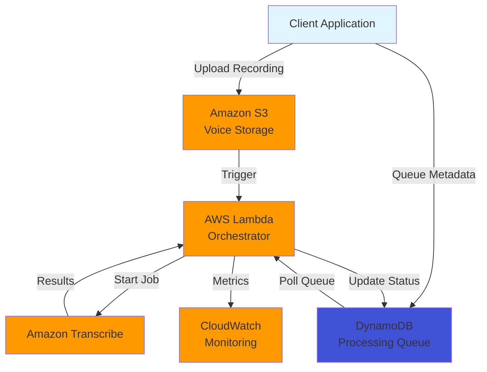

# Design Document: Voice-to-Text Pipeline

## Overview

The Voice-to-Text Pipeline is a cloud-native, serverless architecture designed to handle voice input from regional language speakers in Tier-2/3 India. The system prioritizes reliability in unstable network conditions, cost-effectiveness at scale, and accurate transcription of Hindi, Marathi, and Hinglish speech.

The architecture follows an event-driven pattern using AWS services:
- **Client Layer**: Mobile/web application with offline-first recording capability
- **Storage Layer**: Amazon S3 for durable voice recording storage
- **Queue Layer**: DynamoDB for managing processing state and offline queue
- **Processing Layer**: AWS Lambda for serverless transcription orchestration
- **Transcription Layer**: Amazon Transcribe for speech-to-text conversion
- **Monitoring Layer**: CloudWatch for metrics, logging, and alerting

The system supports two operational modes:
1. **Real-Time Mode**: Streaming transcription for users with stable connectivity
2. **Batch Mode**: Deferred processing for offline recordings and cost optimization

## Architecture

### High-Level Architecture



### Processing Flow

**Real-Time Mode Flow:**
1. Client captures audio and streams to Lambda endpoint
2. Lambda initiates streaming transcription with Amazon Transcribe
3. Partial results stream back to client in real-time
4. Final transcription stored in DynamoDB with S3 reference
5. Confidence scores evaluated and low-confidence items flagged

**Batch Mode Flow:**
1. Client records audio locally when offline
2. Recording queued in local storage with metadata
3. When connectivity restored, client uploads to S3
4. S3 upload triggers Lambda via event notification
5. Lambda creates transcription job in Amazon Transcribe
6. Transcribe processes asynchronously and stores results
7. Lambda polls for completion and updates DynamoDB
8. Client polls DynamoDB for transcription results

**Offline Queue Processing:**
1. Client maintains local queue of pending recordings
2. Periodic connectivity checks trigger sync process
3. Recordings uploaded to S3 in chronological order
4. DynamoDB tracks processing status for each recording
5. Client receives confirmation as each item processes

## Components and Interfaces

### 1. Client Recording Module

**Responsibilities:**
- Capture audio input from device microphone
- Detect and handle network connectivity changes
- Manage local queue for offline recordings
- Upload recordings to S3 when online
- Poll for transcription results

**Interfaces:**

```typescript
interface RecordingModule {
  // Start recording audio
  startRecording(): Promise<RecordingSession>
  
  // Stop recording and return audio data
  stopRecording(sessionId: string): Promise<AudioData>
  
  // Check current network status
  checkConnectivity(): Promise<NetworkStatus>
  
  // Upload recording to cloud
  uploadRecording(audio: AudioData): Promise<UploadResult>
  
  // Get transcription result
  getTranscription(recordingId: string): Promise<TranscriptionResult>
}

interface AudioData {
  recordingId: string
  audioBuffer: ArrayBuffer
  duration: number
  timestamp: number
  format: AudioFormat
  language: LanguageCode
}

interface NetworkStatus {
  isOnline: boolean
  latency: number
  bandwidth: number
}

interface UploadResult {
  recordingId: string
  s3Key: string
  uploadTimestamp: number
  status: UploadStatus
}
```

### 2. S3 Storage Manager

**Responsibilities:**
- Store voice recordings with encryption
- Generate pre-signed URLs for secure access
- Apply lifecycle policies for cost optimization
- Organize files with hierarchical naming

**Interfaces:**

```typescript
interface StorageManager {
  // Upload audio file to S3
  uploadAudio(audio: AudioData, metadata: RecordingMetadata): Promise<S3Location>
  
  // Generate pre-signed URL for transcription service
  generatePresignedUrl(s3Key: string, expirationSeconds: number): Promise<string>
  
  // Apply lifecycle policy to bucket
  applyLifecyclePolicy(policy: LifecyclePolicy): Promise<void>
  
  // Delete recording after retention period
  deleteRecording(s3Key: string): Promise<void>
}

interface S3Location {
  bucket: string
  key: string
  region: string
  url: string
}

interface RecordingMetadata {
  userId: string
  timestamp: number
  language: LanguageCode
  duration: number
  deviceInfo: DeviceInfo
}

interface LifecyclePolicy {
  archiveAfterDays: number
  deleteAfterDays: number
  transitionToIA: boolean
}
```

### 3. DynamoDB Queue Manager

**Responsibilities:**
- Track processing status for all recordings
- Manage offline queue with FIFO ordering
- Store transcription results and metadata
- Enable efficient status queries

**Interfaces:**

```typescript
interface QueueManager {
  // Add recording to processing queue
  enqueueRecording(recording: QueueItem): Promise<void>
  
  // Update recording status
  updateStatus(recordingId: string, status: ProcessingStatus): Promise<void>
  
  // Get next batch of pending recordings
  getNextBatch(batchSize: number): Promise<QueueItem[]>
  
  // Store transcription result
  storeTranscription(recordingId: string, result: TranscriptionResult): Promise<void>
  
  // Query recording status
  getRecordingStatus(recordingId: string): Promise<QueueItem>
}

interface QueueItem {
  recordingId: string
  userId: string
  s3Key: string
  status: ProcessingStatus
  queuedAt: number
  processedAt?: number
  retryCount: number
  language: LanguageCode
}

enum ProcessingStatus {
  PENDING = "PENDING",
  PROCESSING = "PROCESSING",
  COMPLETED = "COMPLETED",
  FAILED = "FAILED",
  REVIEW_NEEDED = "REVIEW_NEEDED"
}
```

### 4. Lambda Orchestrator

**Responsibilities:**
- Coordinate transcription workflow
- Handle S3 event triggers
- Manage batch processing logic
- Implement retry logic with exponential backoff
- Monitor and report metrics

**Interfaces:**

```typescript
interface Orchestrator {
  // Handle S3 upload event
  handleS3Event(event: S3Event): Promise<void>
  
  // Process batch of recordings
  processBatch(items: QueueItem[]): Promise<BatchResult>
  
  // Start real-time transcription
  startRealtimeTranscription(audio: AudioStream): Promise<TranscriptionStream>
  
  // Retry failed transcription
  retryTranscription(recordingId: string): Promise<void>
  
  // Report metrics to CloudWatch
  reportMetrics(metrics: Metrics): Promise<void>
}

interface S3Event {
  bucket: string
  key: string
  size: number
  timestamp: number
}

interface BatchResult {
  processedCount: number
  successCount: number
  failedCount: number
  failedItems: string[]
}

interface Metrics {
  transcriptionCount: number
  successRate: number
  averageLatency: number
  costPerMinute: number
  queueDepth: number
}
```

### 5. Transcription Service Adapter

**Responsibilities:**
- Interface with Amazon Transcribe API
- Handle both streaming and batch transcription
- Extract confidence scores
- Manage language model selection
- Parse and normalize transcription results

**Interfaces:**

```typescript
interface TranscriptionAdapter {
  // Start batch transcription job
  startBatchJob(s3Uri: string, language: LanguageCode): Promise<JobId>
  
  // Start streaming transcription
  startStreamingJob(audioStream: AudioStream, language: LanguageCode): Promise<TranscriptionStream>
  
  // Get job status and results
  getJobResult(jobId: JobId): Promise<TranscriptionResult>
  
  // Detect language from audio
  detectLanguage(s3Uri: string): Promise<LanguageCode>
}

interface TranscriptionResult {
  recordingId: string
  transcription: string
  confidence: number
  wordLevelDetails: WordDetail[]
  language: LanguageCode
  duration: number
  processingTime: number
}

interface WordDetail {
  word: string
  startTime: number
  endTime: number
  confidence: number
}

interface TranscriptionStream {
  onPartialResult(callback: (text: string) => void): void
  onFinalResult(callback: (result: TranscriptionResult) => void): void
  onError(callback: (error: Error) => void): void
  close(): void
}

type LanguageCode = "hi-IN" | "mr-IN" | "en-IN"
type JobId = string
```

### 6. Language Detector

**Responsibilities:**
- Identify spoken language from audio
- Handle code-switching in Hinglish
- Select appropriate transcription model

**Interfaces:**

```typescript
interface LanguageDetector {
  // Detect primary language from audio sample
  detectLanguage(audioSample: ArrayBuffer): Promise<LanguageDetection>
  
  // Detect if code-switching is present
  detectCodeSwitching(audioSample: ArrayBuffer): Promise<boolean>
}

interface LanguageDetection {
  primaryLanguage: LanguageCode
  confidence: number
  secondaryLanguages: LanguageCode[]
  isCodeSwitching: boolean
}
```

## Data Models

### Recording Entity

```typescript
interface Recording {
  // Primary key
  recordingId: string
  
  // User information
  userId: string
  
  // Storage location
  s3Bucket: string
  s3Key: string
  s3Region: string
  
  // Audio metadata
  duration: number
  format: AudioFormat
  sampleRate: number
  channels: number
  fileSize: number
  
  // Language information
  detectedLanguage: LanguageCode
  isCodeSwitching: boolean
  
  // Processing information
  status: ProcessingStatus
  queuedAt: number
  processedAt?: number
  retryCount: number
  
  // Transcription results
  transcription?: string
  confidence?: number
  wordLevelDetails?: WordDetail[]
  
  // Cost tracking
  processingCost: number
  storageCost: number
  
  // Timestamps
  createdAt: number
  updatedAt: number
}

enum AudioFormat {
  WAV = "wav",
  MP3 = "mp3",
  FLAC = "flac",
  OGG = "ogg"
}
```

### Queue Item Entity

```typescript
interface QueueItemEntity {
  // Partition key: status
  pk: string  // "STATUS#<status>"
  
  // Sort key: timestamp + recordingId for FIFO
  sk: string  // "TIMESTAMP#<timestamp>#<recordingId>"
  
  // Recording reference
  recordingId: string
  userId: string
  s3Key: string
  
  // Processing metadata
  status: ProcessingStatus
  queuedAt: number
  processedAt?: number
  retryCount: number
  lastError?: string
  
  // Language
  language: LanguageCode
  
  // TTL for automatic cleanup
  ttl: number
}
```

### Transcription Result Entity

```typescript
interface TranscriptionEntity {
  // Primary key
  recordingId: string
  
  // Transcription data
  transcription: string
  confidence: number
  
  // Word-level details
  words: WordDetail[]
  
  // Metadata
  language: LanguageCode
  duration: number
  processingTime: number
  
  // Quality flags
  needsReview: boolean
  reviewReason?: string
  
  // Timestamps
  createdAt: number
}
```

## Correctness Properties

*A property is a characteristic or behavior that should hold true across all valid executions of a system—essentially, a formal statement about what the system should do. Properties serve as the bridge between human-readable specifications and machine-verifiable correctness guarantees.*


### Property 1: Audio Format Compatibility
*For any* audio recording captured by the system, the output format should be compatible with Amazon Transcribe's supported formats (WAV, MP3, FLAC, or OGG).
**Validates: Requirements 1.1**

### Property 2: Offline Storage Persistence
*For any* recording captured when network is unavailable, the recording should be stored in local storage and retrievable until network connectivity is restored.
**Validates: Requirements 1.2**

### Property 3: Audio Quality Validation
*For any* audio recording, if it meets minimum quality requirements (sample rate ≥ 8kHz, duration > 0), it should pass validation; otherwise it should be rejected.
**Validates: Requirements 1.3**

### Property 4: Unique Recording Identifiers
*For any* set of recording sessions, all generated recording IDs should be unique (no duplicates).
**Validates: Requirements 1.5**

### Property 5: Language Model Selection
*For any* detected language (Hindi, Marathi, or Hinglish), the system should select the corresponding language model for transcription.
**Validates: Requirements 2.1, 2.2, 2.3**

### Property 6: Language Detection Accuracy
*For any* audio sample in a supported language, the language detector should identify the correct primary language.
**Validates: Requirements 2.4**

### Property 7: Encrypted Storage
*For any* recording uploaded to S3, the object metadata should indicate encryption at rest is enabled.
**Validates: Requirements 3.1**

### Property 8: Hierarchical Naming Convention
*For any* recording stored in S3, the key should follow the pattern `{userId}/{timestamp}/{recordingId}.{format}` where timestamp and userId are present.
**Validates: Requirements 3.2**

### Property 9: Pre-signed URL Validity
*For any* generated pre-signed URL, it should be valid for exactly 24 hours (86400 seconds) from generation time.
**Validates: Requirements 3.3**

### Property 10: Retry with Exponential Backoff
*For any* failed operation (storage or transcription), the system should retry up to 3 times with exponentially increasing delays (e.g., 1s, 2s, 4s) before marking as permanently failed.
**Validates: Requirements 3.5, 10.2**

### Property 11: Offline Queue Persistence
*For any* recording captured while offline, it should appear in the processing queue with PENDING status.
**Validates: Requirements 4.1**

### Property 12: Auto-sync on Connectivity Restoration
*For any* queued recording, when network connectivity is restored, the recording should be automatically uploaded to S3.
**Validates: Requirements 4.2**

### Property 13: Status Transition Correctness
*For any* recording, status transitions should follow the valid state machine: PENDING → PROCESSING → (COMPLETED | FAILED | REVIEW_NEEDED).
**Validates: Requirements 4.3, 5.2**

### Property 14: FIFO Queue Processing
*For any* set of queued recordings, they should be processed in chronological order based on their capture timestamp (oldest first).
**Validates: Requirements 4.4**

### Property 15: Queue Persistence on Failure
*For any* recording that fails processing, it should remain in the queue with incremented retry count rather than being removed.
**Validates: Requirements 4.5**

### Property 16: Transcription Completeness
*For any* valid audio recording in S3, the transcription service should return a non-empty text transcription.
**Validates: Requirements 5.1**

### Property 17: Word-level Details Completeness
*For any* transcription result, every word in the transcription should have both a timestamp (start/end) and a confidence score.
**Validates: Requirements 5.3, 6.2**

### Property 18: Error Logging on Transcription Failure
*For any* transcription that fails, an error log entry should be created with timestamp, recording ID, and error details, and the recording status should be marked for review.
**Validates: Requirements 5.5**

### Property 19: Confidence Score Presence
*For any* completed transcription, both an overall confidence score and word-level confidence scores should be present in the result.
**Validates: Requirements 6.1, 6.2, 6.4**

### Property 20: Low Confidence Flagging
*For any* transcription with overall confidence score below 0.7, the recording status should be set to REVIEW_NEEDED.
**Validates: Requirements 6.3**

### Property 21: Confidence Score Retrieval
*For any* transcription query, the response should include both overall and word-level confidence scores.
**Validates: Requirements 6.5**

### Property 22: Real-time Streaming Behavior
*For any* recording in real-time mode, audio should be streamed to the transcription service rather than uploaded as a complete file.
**Validates: Requirements 7.1**

### Property 23: Partial Results in Real-time
*For any* ongoing real-time transcription, partial results should be emitted before the final result.
**Validates: Requirements 7.2**

### Property 24: Pause Detection and Segmentation
*For any* real-time transcription with detected speech pauses, transcription segments should be finalized at pause boundaries.
**Validates: Requirements 7.3**

### Property 25: Mode Switching on High Latency
*For any* real-time transcription session, if network latency exceeds 3 seconds, the system should switch to batch mode.
**Validates: Requirements 7.5**

### Property 26: Batch Size Limit
*For any* batch of recordings in batch mode, the batch size should not exceed 100 recordings.
**Validates: Requirements 8.1**

### Property 27: Batch Trigger Conditions
*For any* batch processing cycle, processing should be triggered when either 5 minutes have elapsed since last batch OR batch size reaches 100 recordings.
**Validates: Requirements 8.2**

### Property 28: Batch Status Updates
*For any* completed batch, all recordings in the batch should have their status updated in the processing queue.
**Validates: Requirements 8.3**

### Property 29: Batch Processing Order
*For any* batch of recordings, recordings should be processed in order of age (oldest first).
**Validates: Requirements 8.4**

### Property 30: Standard Model Selection
*For any* transcription job, the system should use standard accuracy models rather than premium models unless explicitly configured otherwise.
**Validates: Requirements 9.2**

### Property 31: Audio Compression
*For any* recording before storage, the audio should be compressed to reduce file size while maintaining sufficient quality for transcription.
**Validates: Requirements 9.3**

### Property 32: Error Log Completeness
*For any* component failure, the error log should contain timestamp, user identifier, recording ID (if applicable), and error context.
**Validates: Requirements 10.1**

### Property 33: Alert Generation on Critical Errors
*For any* critical error (e.g., service unavailability, quota exceeded), an alert should be sent to system operators.
**Validates: Requirements 10.3**

### Property 34: Metrics Tracking
*For any* processing cycle, the system should track and report metrics including transcription success rate, average latency, and cost per minute.
**Validates: Requirements 10.4**

## Error Handling

### Error Categories

**1. Network Errors**
- Connection timeout during upload
- Connection lost during streaming transcription
- DNS resolution failures

**Handling Strategy:**
- Implement exponential backoff retry (3 attempts)
- Fall back to offline queue if retries exhausted
- Log network error details for diagnostics

**2. Transcription Errors**
- Unsupported audio format
- Audio quality too low
- Language detection failure
- Transcribe service quota exceeded

**Handling Strategy:**
- Validate audio format before submission
- Check audio quality metrics (sample rate, duration, noise level)
- Retry with different language model if detection uncertain
- Queue for later processing if quota exceeded
- Mark for manual review if persistent failures

**3. Storage Errors**
- S3 upload failure
- Insufficient storage quota
- Access denied errors

**Handling Strategy:**
- Retry with exponential backoff
- Maintain local copy until upload succeeds
- Alert operators if quota issues
- Verify IAM permissions on access denied

**4. Queue Processing Errors**
- DynamoDB throttling
- Item not found errors
- Conditional check failures

**Handling Strategy:**
- Implement exponential backoff for throttling
- Use batch operations to reduce API calls
- Handle concurrent updates with optimistic locking
- Log and alert on persistent queue issues

### Error Recovery Patterns

**Retry with Exponential Backoff:**
```typescript
async function retryWithBackoff<T>(
  operation: () => Promise<T>,
  maxRetries: number = 3,
  baseDelay: number = 1000
): Promise<T> {
  for (let attempt = 0; attempt < maxRetries; attempt++) {
    try {
      return await operation()
    } catch (error) {
      if (attempt === maxRetries - 1) throw error
      
      const delay = baseDelay * Math.pow(2, attempt)
      await sleep(delay)
    }
  }
  throw new Error("Max retries exceeded")
}
```

**Circuit Breaker Pattern:**
```typescript
class CircuitBreaker {
  private failureCount: number = 0
  private lastFailureTime: number = 0
  private state: "CLOSED" | "OPEN" | "HALF_OPEN" = "CLOSED"
  
  async execute<T>(operation: () => Promise<T>): Promise<T> {
    if (this.state === "OPEN") {
      if (Date.now() - this.lastFailureTime > 60000) {
        this.state = "HALF_OPEN"
      } else {
        throw new Error("Circuit breaker is OPEN")
      }
    }
    
    try {
      const result = await operation()
      this.onSuccess()
      return result
    } catch (error) {
      this.onFailure()
      throw error
    }
  }
  
  private onSuccess(): void {
    this.failureCount = 0
    this.state = "CLOSED"
  }
  
  private onFailure(): void {
    this.failureCount++
    this.lastFailureTime = Date.now()
    
    if (this.failureCount >= 5) {
      this.state = "OPEN"
    }
  }
}
```

**Graceful Degradation:**
- If real-time transcription fails, fall back to batch mode
- If language detection fails, default to Hindi (most common)
- If confidence scoring unavailable, proceed without flagging
- If metrics reporting fails, continue processing (non-critical)

### Error Monitoring

**CloudWatch Alarms:**
- Transcription failure rate > 5%
- Average queue depth > 1000 items
- Storage upload failure rate > 2%
- Average processing latency > 60 seconds
- Cost per minute exceeds budget threshold

**Error Metrics:**
- Count of errors by category (network, transcription, storage, queue)
- Error rate trends over time
- Retry success rate
- Time to recovery for failed operations

## Testing Strategy

### Dual Testing Approach

The system will be validated using both unit tests and property-based tests:

**Unit Tests** focus on:
- Specific examples of correct behavior
- Edge cases (empty audio, maximum duration, boundary conditions)
- Error conditions (network failures, invalid formats, quota exceeded)
- Integration points between components

**Property-Based Tests** focus on:
- Universal properties that hold for all inputs
- Comprehensive input coverage through randomization
- Invariants that must be maintained across operations
- State machine transitions and ordering guarantees

Both approaches are complementary and necessary for comprehensive coverage.

### Property-Based Testing Configuration

**Framework Selection:**
- **TypeScript/JavaScript**: fast-check
- **Python**: Hypothesis
- **Java**: jqwik

**Test Configuration:**
- Minimum 100 iterations per property test
- Each test tagged with feature name and property number
- Tag format: `Feature: voice-to-text-pipeline, Property {N}: {property description}`

**Example Property Test (TypeScript with fast-check):**

```typescript
import fc from 'fast-check'

// Feature: voice-to-text-pipeline, Property 4: Unique Recording Identifiers
describe('Recording ID Generation', () => {
  it('should generate unique IDs for all recordings', () => {
    fc.assert(
      fc.property(
        fc.array(fc.record({
          userId: fc.string(),
          timestamp: fc.integer(),
          audioData: fc.uint8Array()
        }), { minLength: 2, maxLength: 100 }),
        (recordings) => {
          const ids = recordings.map(r => generateRecordingId(r))
          const uniqueIds = new Set(ids)
          return ids.length === uniqueIds.size
        }
      ),
      { numRuns: 100 }
    )
  })
})

// Feature: voice-to-text-pipeline, Property 14: FIFO Queue Processing
describe('Queue Processing Order', () => {
  it('should process recordings in chronological order', () => {
    fc.assert(
      fc.property(
        fc.array(fc.record({
          recordingId: fc.uuid(),
          timestamp: fc.integer({ min: 0, max: 1000000 })
        }), { minLength: 2, maxLength: 50 }),
        async (recordings) => {
          // Add recordings to queue
          for (const rec of recordings) {
            await queueManager.enqueueRecording(rec)
          }
          
          // Get next batch
          const batch = await queueManager.getNextBatch(recordings.length)
          
          // Verify chronological order
          for (let i = 1; i < batch.length; i++) {
            if (batch[i].timestamp < batch[i-1].timestamp) {
              return false
            }
          }
          return true
        }
      ),
      { numRuns: 100 }
    )
  })
})
```

### Unit Test Examples

```typescript
describe('Audio Format Validation', () => {
  it('should accept WAV format', () => {
    const audio = createAudioData({ format: 'wav' })
    expect(validateAudioFormat(audio)).toBe(true)
  })
  
  it('should reject unsupported format', () => {
    const audio = createAudioData({ format: 'avi' })
    expect(validateAudioFormat(audio)).toBe(false)
  })
  
  it('should handle empty audio buffer', () => {
    const audio = createAudioData({ buffer: new ArrayBuffer(0) })
    expect(validateAudioFormat(audio)).toBe(false)
  })
})

describe('Confidence Score Flagging', () => {
  it('should flag transcription with confidence 0.65', () => {
    const result = { transcription: 'test', confidence: 0.65 }
    expect(shouldFlagForReview(result)).toBe(true)
  })
  
  it('should not flag transcription with confidence 0.75', () => {
    const result = { transcription: 'test', confidence: 0.75 }
    expect(shouldFlagForReview(result)).toBe(false)
  })
  
  it('should flag transcription at exact threshold 0.7', () => {
    const result = { transcription: 'test', confidence: 0.7 }
    expect(shouldFlagForReview(result)).toBe(false)
  })
})
```

### Integration Testing

**End-to-End Flows:**
1. **Happy Path - Real-time Transcription:**
   - User starts recording with good connectivity
   - Audio streams to Lambda
   - Transcription returns within 2 seconds
   - Result stored in DynamoDB
   - Client retrieves transcription

2. **Offline Recording and Sync:**
   - User records while offline
   - Recording queued locally
   - Network restored
   - Auto-sync uploads to S3
   - Batch processing transcribes
   - Client polls and retrieves result

3. **Error Recovery:**
   - Upload fails due to network
   - Retry with backoff succeeds
   - Transcription proceeds normally

**Test Environment:**
- LocalStack for AWS service mocking
- Mock network conditions (latency, packet loss)
- Simulated audio files in test languages
- DynamoDB Local for queue testing

### Performance Testing

**Load Testing Scenarios:**
- 1000 concurrent real-time transcriptions
- 10,000 recordings in offline queue
- Batch processing of 100 recordings
- Sustained load of 40K minutes per month

**Performance Targets:**
- Real-time transcription latency: < 2 seconds (p95)
- Batch processing throughput: > 100 recordings per minute
- Queue processing lag: < 5 minutes
- S3 upload success rate: > 98%
- Transcription success rate: > 95%

**Cost Validation:**
- Monitor actual costs during load testing
- Verify cost per minute stays within ₹2 (₹80,000 / 40,000 minutes)
- Identify cost optimization opportunities

### Test Data Generation

**Audio Sample Generation:**
- Synthetic speech in Hindi, Marathi, Hinglish
- Various durations (1s to 5 minutes)
- Different quality levels (8kHz to 48kHz)
- Background noise variations
- Regional dialect samples

**Property Test Generators:**
```typescript
// Generator for valid audio data
const audioDataArb = fc.record({
  recordingId: fc.uuid(),
  audioBuffer: fc.uint8Array({ minLength: 1000, maxLength: 100000 }),
  duration: fc.integer({ min: 1, max: 300 }),
  format: fc.constantFrom('wav', 'mp3', 'flac', 'ogg'),
  language: fc.constantFrom('hi-IN', 'mr-IN', 'en-IN'),
  sampleRate: fc.constantFrom(8000, 16000, 44100, 48000)
})

// Generator for queue items
const queueItemArb = fc.record({
  recordingId: fc.uuid(),
  userId: fc.uuid(),
  s3Key: fc.string(),
  status: fc.constantFrom('PENDING', 'PROCESSING', 'COMPLETED', 'FAILED'),
  queuedAt: fc.integer({ min: 0, max: Date.now() }),
  retryCount: fc.integer({ min: 0, max: 3 }),
  language: fc.constantFrom('hi-IN', 'mr-IN', 'en-IN')
})
```

### Continuous Testing

**CI/CD Pipeline:**
1. Unit tests run on every commit
2. Property tests run on every PR
3. Integration tests run on merge to main
4. Performance tests run nightly
5. Cost validation runs weekly

**Test Coverage Goals:**
- Line coverage: > 80%
- Branch coverage: > 75%
- Property coverage: 100% of correctness properties
- Integration coverage: All critical user flows
